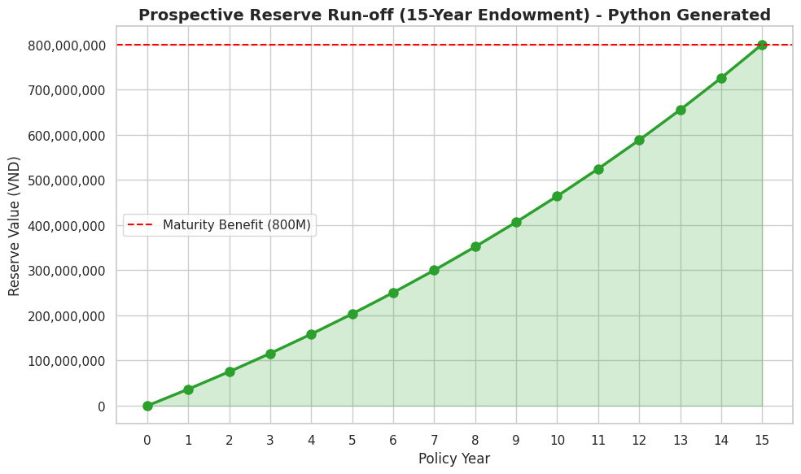
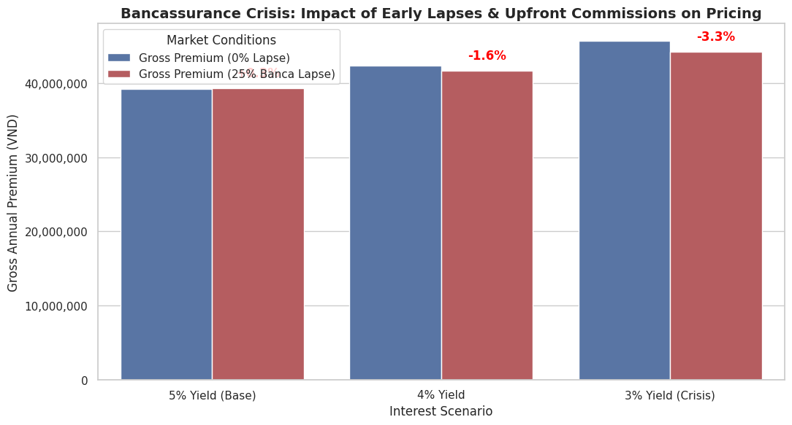
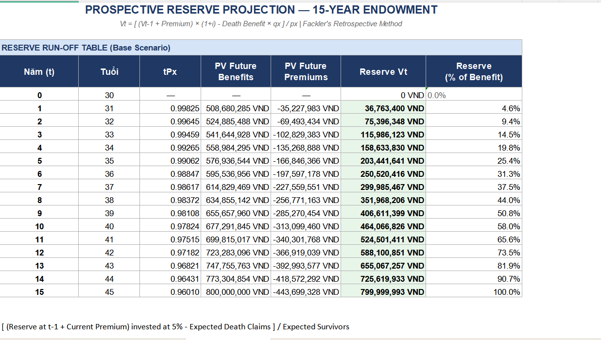
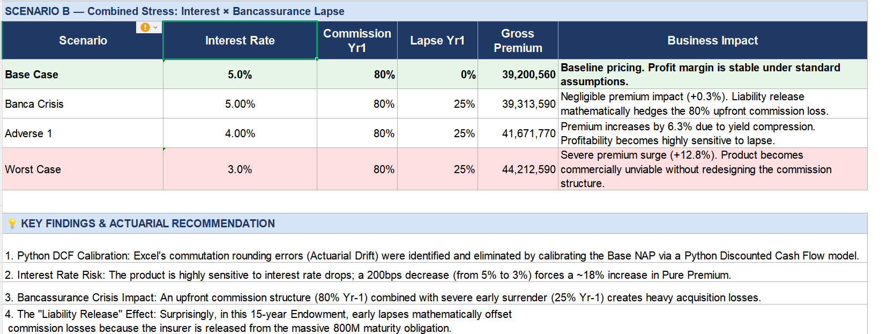

# Actuarial DCF Pricing & Fackler Reserve Engine for 15-Year Endowment Insurance 

## Project Overview
This project simulates an actuarial pricing and reserving engine for a 15-year Education Endowment product tailored for the Vietnam Middle-Income Market. The main objective is to measure the financial impact of the post-2022 Bancassurance crisis (characterized by high upfront agent commissions and massive early lapse rates).

## Tools & Technologies
*   **Core Actuarial Logic:** MS Excel (Cash Flow Projections, Fackler's Retrospective Method)
*   **Automation & Stress Testing:** Python (pandas, matplotlib, seaborn)
*   **Mortality Table:** CSO 1980 (Vietnam Ministry of Finance - Circular 156/2007)

## Key Actuarial Methodologies
1.  **Multiple Decrement Model:** Incorporated dynamic lapse rates alongside standard mortality.
2.  **Model Calibration:** Built a Python DCF engine to calculate the *Exact Net Annual Premium*, eliminating Actuarial Drift (rounding errors) found in Excel commutation functions.
3.  **Fackler's Reserve:** Successfully converged the prospective reserve to exactly 800,000,000 VND at maturity (Year 15).

## Stress Testing & Market Insights
I automated a scenario analysis (Interest Rate × Lapse Rate) and uncovered a critical pricing insight:
> **The "Liability Release" Effect:** In heavily savings-oriented products (like Endowments), early surrenders mathematically offset the high initial acquisition costs (80% Year-1 Commission). 

### Visualizations:
*Reserve Run-off Curve ensuring 800M maturity target:*

*Premium impact of Bancassurance Lapse Crisis:*

---
*Created by Trinh Xuan Mai as a personal academic project.*
## Excel Model Screenshots

**Sheet 3 — Prospective Reserve Projection (Fackler's Method)**

The reserve table converges exactly to **800,000,000 VND** at Year 15 (100.0% of Sum Assured), validating full pricing accuracy. Reserve grows from 4.6% of benefit at Year 1 to 90.7% at Year 14 before full convergence.

---

**Sheet 4 — Stress Testing: Interest Rate × Bancassurance Lapse**

| Scenario | Interest Rate | Lapse Yr1 | Gross Premium | Business Impact |
|---|---|---|---|---|
| **Base Case** | 5.0% | 0% | 39,200,560 VND | Stable. Profit margin sustainable. |
| Banca Crisis | 5.0% | 25% | 39,313,590 VND | +0.3% only — Liability Release hedges commission loss. |
| Adverse | 4.0% | 25% | 41,671,770 VND | +6.3% — Profitability highly sensitive to lapse. |
| **Worst Case** | 3.0% | 25% | 44,212,590 VND | **+12.8% surge — Product unviable without commission redesign.** |

---

## 🔑 Key Business Finding

> ✅ The product remains **commercially viable at 5% yield and 25% Year-1 lapse rate** — the "Liability Release" effect mathematically offsets the heavy 80% upfront agent commission.
>
> ⚠️ However, commission restructuring is **critical** if interest rates fall below 4% — at 3% yield, gross premium surges **+12.8%**, making the product commercially unviable without redesigning the commission structure.
>
> 📌 A 200bps interest rate drop (5% → 3%) forces an ~18% increase in Pure Premium — highlighting extreme sensitivity to yield compression in long-term savings products.
